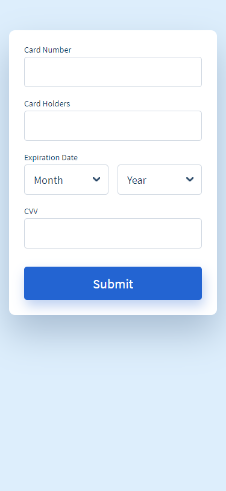

# Payment form
Using HTML, CSS (CSS or Sass) and JavaScript develop the form shown in the design below.
## Design

## Specification
 - Global font family: Source Sans Pro, Google Font
 - Font sizes:
   - Form label: 14px
   - Form input: 18px
   - Form button: 22px
 - Font weight:
   - Form label: 500
   - Form input: 400
   - Form button: 500
 - Colours:
   - Page background: #ddeefc
   - Form background: #ffffff
   - Form label text colour: #1a3b5d
   - Form input text colour: #1a3b5d
   - Form input border colour: #ced6e0
   - Form input border colour on hover: #3d9cff
   - Form input dropdown arrow: #1a3b5d
   - Form button background: #2364d2
 - Shadows:
   - Form background: 0 30px 60px 0 rgb(90 116 148 / 40%)
   - Form button: 3px 10px 20px 0px rgb(35 100 210 / 30%)
   - Form input on focus: 0px 10px 20px -13px rgb(32 56 117 / 35%)
 - Border radius:
   - Form background: 10px
   - Form input: 5px
   - Form button: 5px
 - Spacing:
   - Form background padding:
     - Mobile: 25px
     - Desktop: 35px
   - Form input padding: 5px 15px
   - Form input dropdown padding right: 30px
   - Form input dropdown space between: 15px
   - Form input margin bottom: 20px
   - Form label margin bottom: 5px
   - Form button margin top:
     - Mobile: 10px
     - Desktop: 20px
 - Use the "keyboard_arrow_down" from Material design icons for the dropdown arrow
 - Validation:
   - Only allow numeric characters in the card number and CVV fields
   - Use the Luhn algorithm to validate card numbers
   - Format card number with spaces in the following format:
     - Amex: #### #### #### ###
     - Diner's Club: #### #### #### ##
     - Anything else: #### #### #### ####
## Extra considerations
You must use [BEM naming conventions](http://getbem.com/naming/)
Please also consider:
 - Readability of code
 - Cross browser/device compatibility
 - Accessibility
 - Performance and load time# luhn-algorithm-credit-card-form
